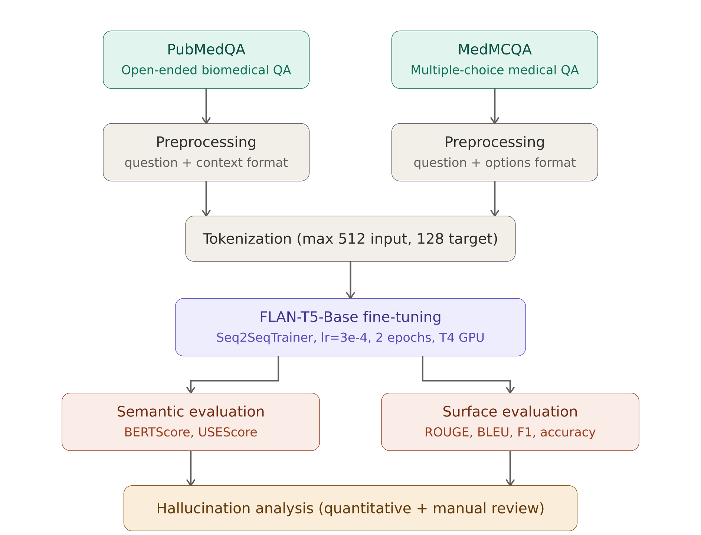
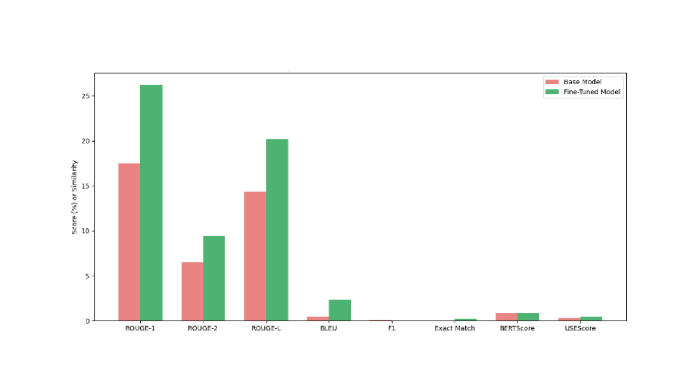
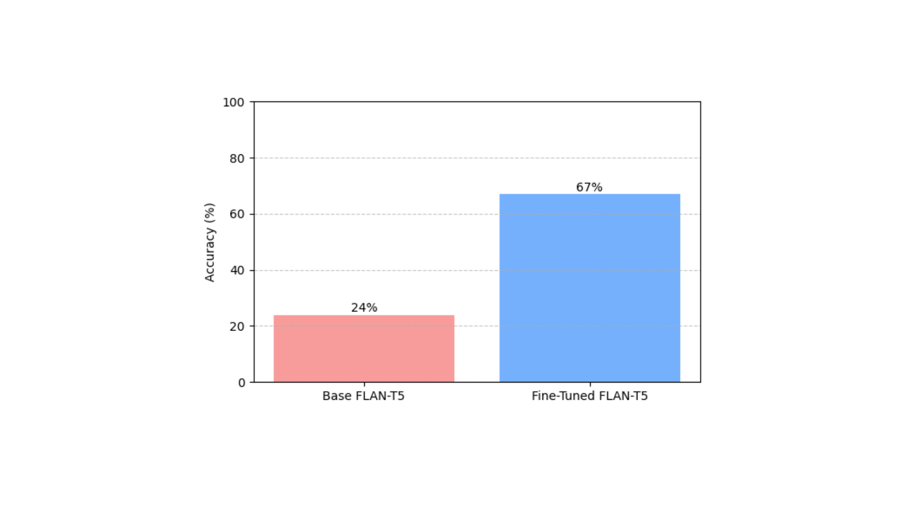

# Domain-Specific LLM Adaptation: Transformer Pipeline for Medical Question Answering

Trained Google's FLAN-T5 (an encoder-decoder transformer) to medical question answering using two benchmarks: PubMedQA for open-ended biomedical questions and MedMCQA for multiple-choice medical exam questions. The pipeline covers preprocessing, training, evaluation across six metrics, and a closer look at where the model hallucinates.

## Why this project

LLMs are good at a lot of things. Medical questions are not one of them, at least not out of the box. The vocabulary is specialized, the reasoning needs to be precise, and getting an answer mostly right is often worse than getting it obviously wrong.

I wanted to test how far domain adaptation could take a mid-sized model (FLAN-T5-Base, ~250M parameters) on medical QA, without needing huge compute. Targeted adaptation on relevant data, then a serious look at what actually changed and what still broke.

## Pipeline overview



## Key results

| Metric | Base FLAN-T5 | After Adaptation | Change |
|--------|-------------|-----------------|--------|
| **MedMCQA Accuracy** | 24% | 67% | +43 pts |
| **ROUGE-1** (PubMedQA) | 17.53% | 26.21% | +8.68 pts |
| **ROUGE-2** (PubMedQA) | 6.45% | 9.43% | +2.98 pts |
| **ROUGE-L** (PubMedQA) | 14.37% | 20.21% | +5.84 pts |
| **BLEU** (PubMedQA) | 0.44% | 2.32% | +1.88 pts |
| **F1 Score** (PubMedQA) | 0.138 | 0.205 | +0.067 |
| **BERTScore F1** (PubMedQA) | 0.846 | 0.878 | +0.032 |
| **USEScore** (PubMedQA) | 0.319 | 0.442 | +0.123 |

MedMCQA was the standout. The base model scored 24% on 4-choice questions, which is random guessing. After adaptation it hit 67%. PubMedQA improvements were smaller but showed up across every metric.

<!-- Uncomment when you add chart images from the paper:


-->

## Approach

I used FLAN-T5-Base, Google's instruction-tuned T5 variant. It's an encoder-decoder transformer, which makes it a natural fit for question-in-answer-out tasks. The base version (~250M params) was a deliberate choice over larger variants since I wanted to see what adaptation alone could do without brute-forcing it with scale.

Two datasets, two separate models:

**PubMedQA** is a biomedical research QA dataset. Each sample has a question, a PubMed abstract as context, and an expert-written long-form answer. I used the `pqa_labeled` split (10% for prototyping). The input to the model looks like `question: ... context: ...` and the target is the full expert answer.

**MedMCQA** has ~194k multiple-choice questions from Indian medical entrance exams (AIIMS, NEET PG). I used 10% of the training split. Input format: `question: ... options: A. ... B. ... C. ... D. ...` with the correct option text as the target.

Training ran on HuggingFace's Seq2SeqTrainer. Inputs truncated to 512 tokens, targets to 128. Batch size 4, learning rate 3e-4, 2 epochs, weight decay 0.01. All on a single T4 GPU through Google Colab.

For evaluation, I used six metrics because none of them tell the whole truth on their own. ROUGE and BLEU catch lexical overlap but penalize valid paraphrases. BERTScore uses contextual embeddings and is more forgiving of rephrasing, but it can also score a wrong answer high if it's semantically close to the right one. USEScore (Universal Sentence Encoder cosine similarity) gives a sentence-level read on meaning. F1 and Exact Match are there as hallucination proxies. Using surface and semantic metrics together catches things either type would miss alone.

## Where it works and where it breaks

**Worked well:**

> **Q:** Is there a link between gut microbiota and autoimmune diseases?
> **Context:** Gut microbiota influences many aspects of human health and immune function.
> **Predicted:** Gut microbiota plays an important role in the development of autoimmune diseases.

Relevant, coherent, directionally correct. Vague though. A human expert would mention specific mechanisms.

**Hallucination:**

> **Q:** What are the long-term effects of chemotherapy on cognitive function?
> **Context:** Chemotherapy is a common cancer treatment that may have side effects.
> **Predicted:** Alzheimer's disease is a common side effect of chemotherapy.

Factually wrong. Chemo can cause cognitive issues ("chemo brain"), but Alzheimer's is a specific neurodegenerative disease, not a side effect. The model grabbed the cognitive theme and jumped to the most prominent cognitive disease it knew. Confident, fluent, and incorrect. This is the kind of output that makes medical AI dangerous without a verification layer on top.

**MCQ failure:**

> **Q:** Which vitamin deficiency causes scurvy?
> **Options:** Vitamin A, Vitamin C, Vitamin D, Vitamin B12
> **Predicted:** Vitamin A | **Correct:** Vitamin C

Basic factual miss. This one persisted after adaptation.

## Laerning Outcomes

The 24% to 67% jump on MedMCQA came from just 10% of the training data and 2 epochs. That surprised me. Domain data matters a lot for structured tasks, and you don't always need a ton of it.

The model still hallucinates on open-ended questions though. The Alzheimer's example is one of several I found. The annoying part is that semantic metrics can actually hide these, because the embedding distance between "cognitive side effects" and "Alzheimer's" is small. A high BERTScore does not mean a correct answer.

BLEU was nearly useless here (0.44% to 2.32%), which makes sense since it was built for translation where there's roughly one right way to say something. Open-ended QA has dozens of valid phrasings.

One thing I didn't expect: multiple-choice was harder than open-ended in some ways. The distractor options in MedMCQA have high semantic overlap with the correct answer by design, and that trips the model up even after adaptation.

## Project structure

```
├── notebooks/
│   └── llm_medical_qa.ipynb       # Training + evaluation pipeline
├── paper/
│   └── Research_Paper.pdf         # Full write-up with methodology and analysis
├── presentation/
│   └── Project_Presentation.pptx
├── results/
│   ├── pubmedqa_metrics.json
│   ├── medmcqa_metrics.json
│   └── sample_predictions.md      # More examples with assessments
├── images/
│   ├── pipeline_overview.png
│   ├── pubmedqa_comparison.png
│   └── medmcqa_accuracy.png
└── requirements.txt
```

## How to reproduce

```bash
git clone https://github.com/pavanreddy71000/llm-medical-qa-pipeline.git
cd llm-medical-qa-pipeline
pip install -r requirements.txt
```

Open `notebooks/llm_medical_qa.ipynb` in Google Colab or any Jupyter environment with a GPU. Datasets load from HuggingFace Hub directly, no manual downloads. Training takes about 45 minutes on a T4.

Model weights aren't in the repo (too large). The notebook reproduces them from scratch.

## Tech stack

Python · PyTorch · HuggingFace Transformers · HuggingFace Datasets · TensorFlow Hub · Google Colab

## Future work

RAG is the obvious next step. Right now the model is answering from parametric memory, which is why it hallucinates. Grounding answers in actual retrieved medical literature would help a lot. Beyond that: trying larger FLAN-T5 variants with more data, adding clinical images as input, and exploring RLHF with domain experts to penalize hallucination directly during training.
